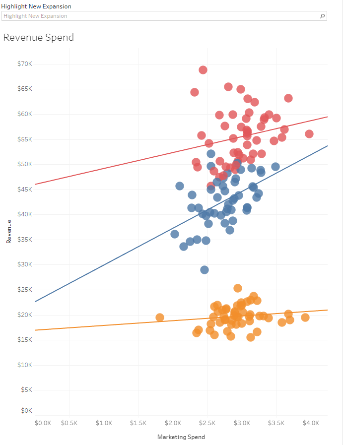

# WeWashUSleep Startup Sales Data Dashboard

This repository contains a Tableau dashboard analyzing the sales data for WeWashUSleep, a startup with a focus on expanding its network in smaller cities. The dashboard provides insights into regional performance, revenue comparisons between established and new cities, and aids investment decision-making based on population and marketing spending.

## Dashboard Overview

### Sales Performance by Region

This graph illustrates the performance comparison between two sales regions within the USA. It highlights how each region is performing based on marketing spending, assisting the CEO in determining which region to prioritize.

**Key Questions:**
- How do the two sales regions compare in terms of revenue and marketing spending?
- Which region is more successful in converting marketing spending into revenue?

### Revenue Comparison - Old vs. New Cities

This visualization showcases the revenue generated from 140 established locations compared to the 10 recently opened cities. It provides insights into the effectiveness of the expansion strategy.

**Key Questions:**
- How does the revenue from the newly opened cities compare to the established locations?
- Is the expansion strategy yielding the desired results in terms of revenue?

### Cluster Analysis and Regression

In this graph, cities are clustered based on population and marketing spending. A regression line indicates the relationship between these factors and revenue, aiding investment decisions.

**Key Questions:**
- How do different clusters of cities perform in terms of revenue generation?
- What is the relationship between population, marketing spending, and revenue?

## Dashboard Preview

**Access the Live Dashboard: [WeWashUSleep Tableau Dashboard](https://public.tableau.com/views/sales_data_analysis_for_startup/Dashboard1?:language=en-US&publish=yes&:display_count=n&:origin=viz_share_link)**

## Challenges Faced

### Data Quality and Consistency
Addressing data quality issues was essential, involving data cleaning and standardization to ensure accurate analysis.

### Data Aggregation and Transformation
Aggregating and transforming data from diverse sources, including the use of Tableau's built-in relations, facilitated meaningful insights into sales performance. The startup sales data was joined with population data of the USA to gain comprehensive insights.

### Cluster Analysis and Interpretation
Creating meaningful clusters required thoughtful consideration of variables and their significance, followed by careful interpretation.

### Regression Analysis
Implementing regression analysis demanded advanced statistical knowledge to accurately depict the relationships between variables.

## Solutions Implemented

### Data Cleaning and Standardization
A comprehensive data cleaning process was executed to ensure consistent and high-quality data for analysis.

### Advanced Analytics and Visualizations
Utilizing clustering and regression techniques produced insightful visualizations that guided decision-making.

## Conclusion

This repository showcases a Tableau dashboard analyzing WeWashUSleep's sales data, providing valuable insights for the company's growth strategy. Overcoming data challenges and employing advanced analytics techniques underscores the commitment to delivering actionable information for informed decision-making.

For detailed project documentation, including data sources and Tableau workbook, please refer to [Project Documentation](link_to_documentation).

For any inquiries or feedback, please contact [Your Name](link_to_contact).
